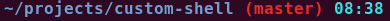

# Goal

Currently, this allows you to see at which you are and time.



# Preparation

Download the script for grabbing information of a local git repository.

```bash
curl https://raw.githubusercontent.com/git/git/master/contrib/completion/git-prompt.sh -o ~/.git-promt.sh
```

or

```bash
wget https://raw.githubusercontent.com/git/git/master/contrib/completion/git-prompt.sh -O ~/.git-promt.sh
```

# Customizing PS1

Append the follwing lines to `~/.bashrc`:

```bash
# Git prompt
GIT_PROMPT_FILE="$HOME/.git-promt.sh"
if [ -a $GIT_PROMPT_FILE ] ; then
    source $GIT_PROMPT_FILE
    length=$((${#PS1}-3))
    ps1_prefix=${PS1:0:length}
    ps1_suffix='\[\033[01;31m\]$(__git_ps1)\[\033[00m\] \[\033[01;36m\]\A\[\033[00m\] \$ '
    PS1="${ps1_prefix}${ps1_suffix}"
fi
```

Refer to [EzPrompt](http://ezprompt.net/) for color customization or others.

Finally, open a terminal to view changes.